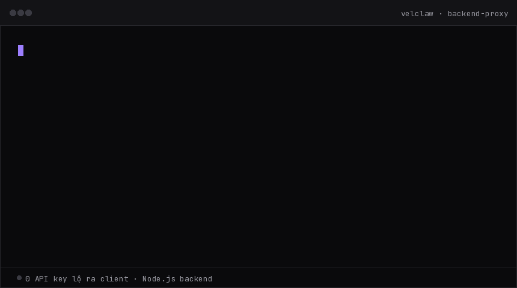

# Velclaw

Một canvas. Nhiều agent AI. Key không bao giờ rời server.

Velclaw là không gian làm việc kết nối nhiều agent AI, một thư viện skill dùng
chung, và các API AI của bên thứ ba — tất cả thông qua **một backend trung
gian duy nhất**. Trình duyệt của bạn không bao giờ cần biết đến API key thật.

Kho mã nguồn: https://github.com/Velclaw/Velclaw



> Ảnh động demo được đặt ở thư mục gốc của repo để đường dẫn hiển thị trên GitHub khớp với cấu trúc hiện tại.

---

## Vì sao có Velclaw

Gọi thẳng API key từ frontend là rủi ro bảo mật lớn nhất khi build app AI.
Velclaw giải quyết việc đó bằng một nguyên tắc duy nhất, không có ngoại lệ:

> **Key không rời máy chủ.** Nếu một tính năng cần key ở phía client, tính
> năng đó chưa xong.

```
Trình duyệt  →  Backend (giữ key)  →  API bên thứ 3
```

## Tính năng cốt lõi

| Khối chức năng | Mô tả |
|---|---|
| Agent runtime | Điều phối nhiều agent AI chạy song song trên cùng một canvas |
| Thư viện skill | Skill nạp theo yêu cầu, tái sử dụng giữa các agent |
| Nhật ký & giám sát | Ghi log mọi lệnh gọi, theo dõi chi phí/độ trễ/tỉ lệ lỗi |
| API key không rời server | Key chỉ tồn tại trong biến môi trường phía backend |
| Storage & build | Lưu trạng thái agent và artefact trong cùng một hạ tầng |
| Dịch vụ người dùng | Một lớp user service dùng chung: xác thực, phiên, quyền hạn |

## Bốn nguyên tắc thiết kế

1. **Key không rời máy chủ** — không có ngoại lệ.
2. **Không khoá nhà cung cấp** — đổi provider là đổi một URL trong `server.js`.
3. **Log là bắt buộc, không tuỳ chọn** — request không log là request không
   thể debug khi có sự cố.
4. **Mở rộng ngang, không mở rộng dọc** — thêm agent bằng cách thêm pane, không
   phải viết thêm nhánh `if`.

## Cài đặt nhanh

```bash
git clone https://github.com/Velclaw/Velclaw.git
cd Velclaw
npm install
cp .env.example .env   # điền API key của bạn
npm run dev
```

`.env` (không commit lên git):

```env
THIRD_PARTY_API_KEY=your_actual_key_here
```

`server.js` — điểm duy nhất chạm vào key thật:

```js
app.post('/api/chat', async (req, res) => {
  const r = await fetch('https://api.example-provider.com/v1/messages', {
    method: 'POST',
    headers: { 'Authorization': `Bearer ${process.env.THIRD_PARTY_API_KEY}` },
    body: JSON.stringify(req.body)
  });
  res.json(await r.json());
});
```

## Nhà tài trợ

Velclaw hiện **chưa có nhà tài trợ nào** — mọi vị trí đều đang mở. Nếu dự án
hữu ích với bạn, hãy cân nhắc trở thành người đầu tiên tại
[github.com/sponsors/Velclaw](https://github.com/sponsors/Velclaw).

## Đóng góp

Issue và pull request đều được hoan nghênh tại
[github.com/Velclaw/Velclaw](https://github.com/Velclaw/Velclaw).

## Giấy phép

MIT.
